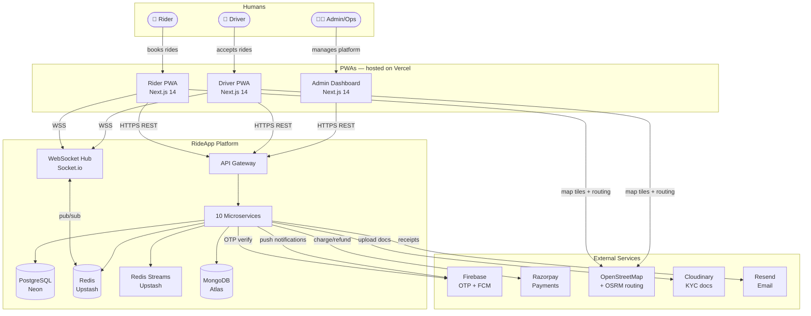
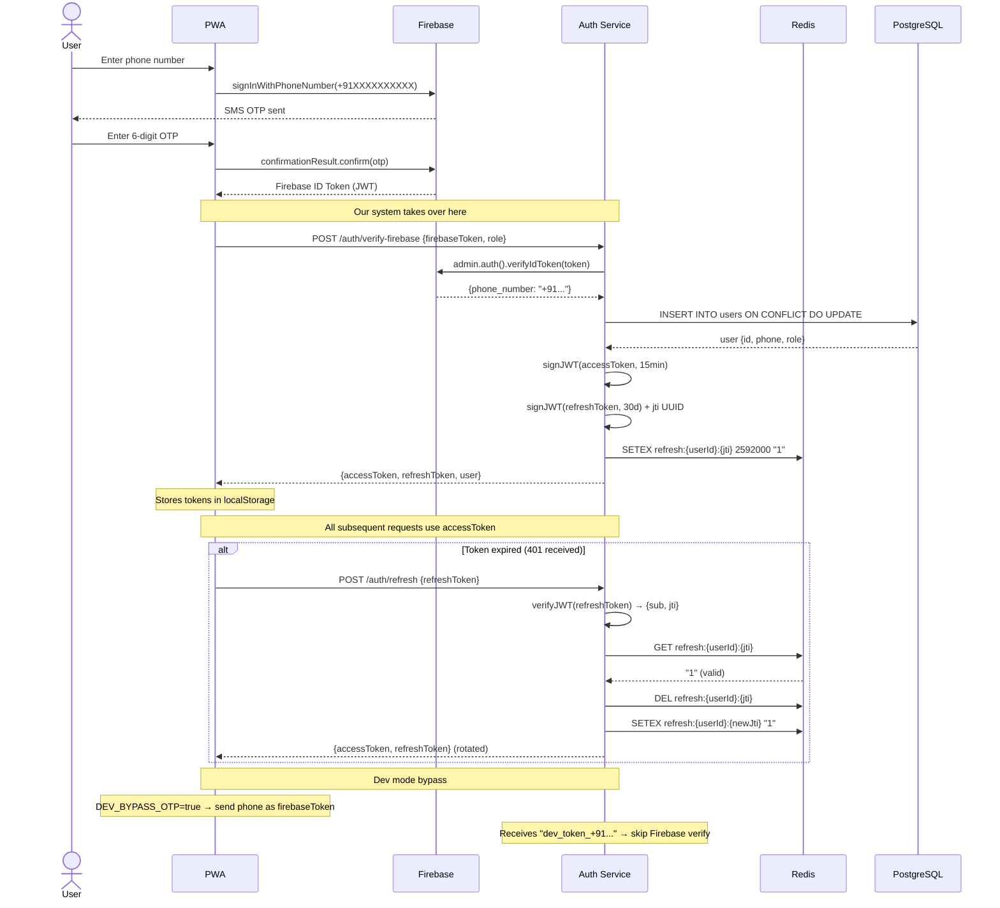
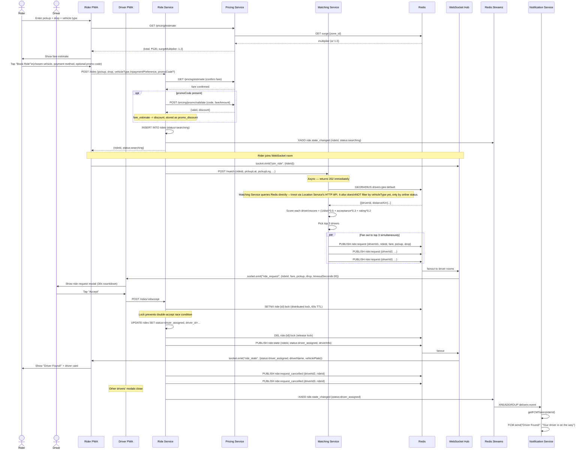
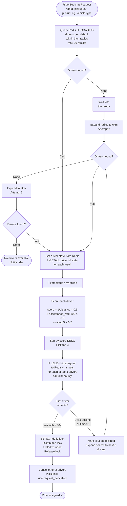
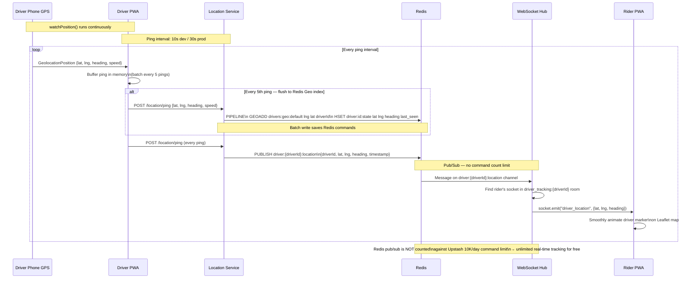
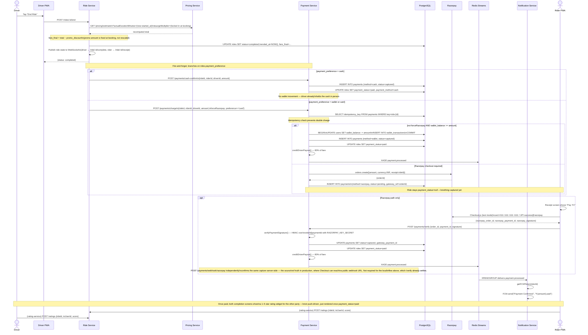
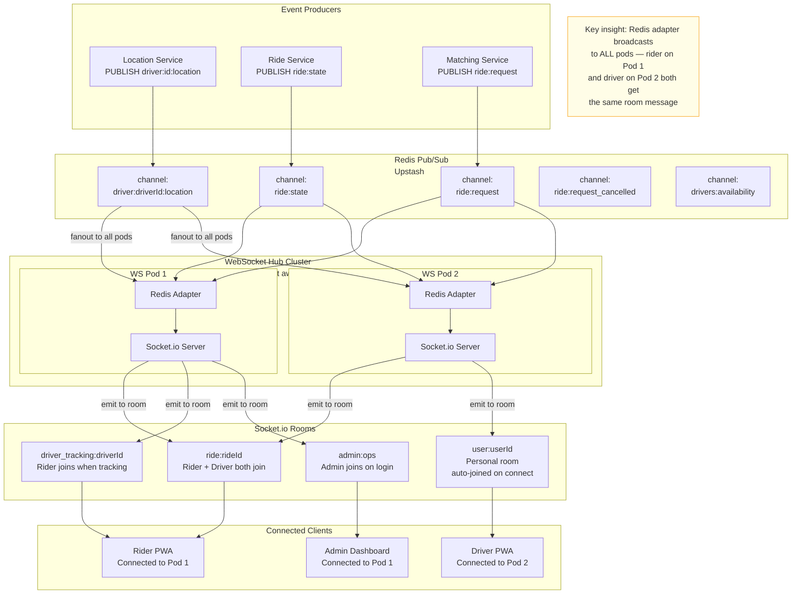
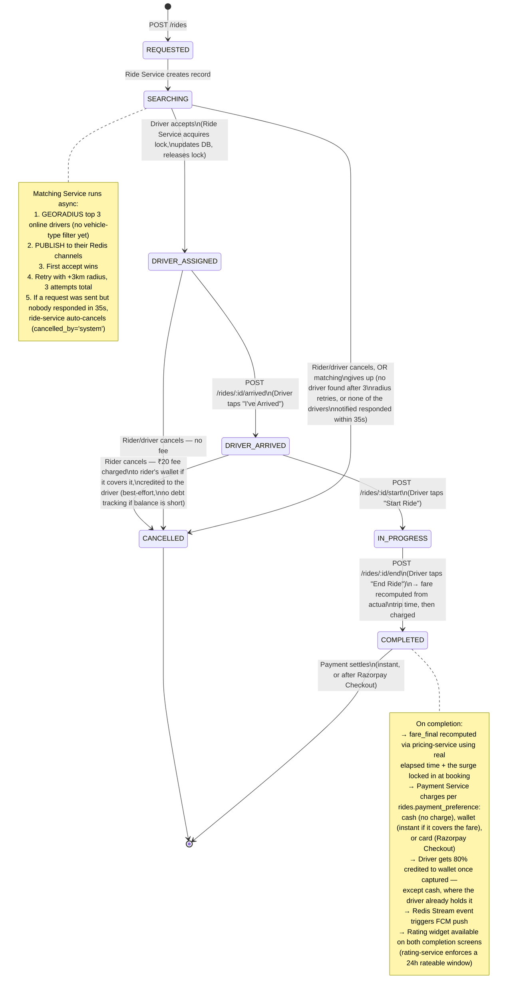
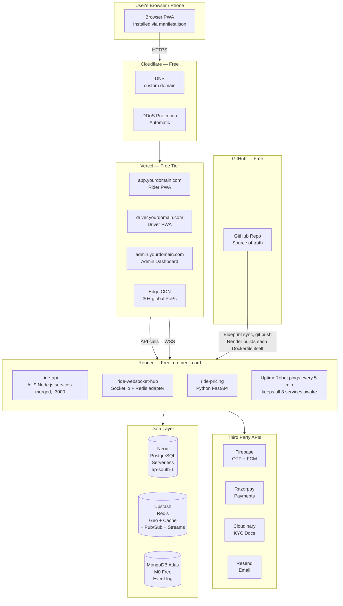

# RideApp — System Architecture & Code Flow

> Complete technical reference. All diagrams use **Mermaid**.  
> View in: VS Code (`Markdown Preview Mermaid Support` extension) · GitHub · [mermaid.live](https://mermaid.live)

---

## Table of Contents

1. [System Overview](#1-system-overview)
2. [Service Container Map](#2-service-container-map)
3. [Auth Flow — OTP to JWT](#3-auth-flow--otp-to-jwt)
4. [Ride Booking — End to End](#4-ride-booking--end-to-end)
5. [Driver Matching Algorithm](#5-driver-matching-algorithm)
6. [Real-time GPS Tracking](#6-real-time-gps-tracking)
7. [Payment Processing Flow](#7-payment-processing-flow)
8. [WebSocket Architecture](#8-websocket-architecture)
9. [Ride State Machine](#9-ride-state-machine)
10. [Database ERD](#10-database-erd)
11. [Redis Streams Event Bus](#11-redis-streams-event-bus)
12. [Deployment Architecture](#12-deployment-architecture)
13. [Request Lifecycle — How a Booking Actually Flows Through Code](#13-request-lifecycle)

---

## 1. System Overview

Three types of humans interact with the system. Every interaction eventually touches a shared set of microservices, data stores, and third-party APIs.



---

## 2. Service Container Map

How the 10 microservices relate to each other and which data stores they own.

```mermaid
flowchart LR
    subgraph Auth["Auth Service :3101"]
        direction TB
        A1[POST /auth/verify-firebase]
        A2[POST /auth/refresh]
        A3[POST /auth/logout]
    end

    subgraph User["User Service :3102"]
        U1[GET/PUT /users/me]
        U2[/users/me/addresses]
        U3[/users/me/wallet]
    end

    subgraph Driver["Driver Service :3103"]
        DR1[POST /drivers/register]
        DR2[POST /drivers/me/vehicle]
        DR3[POST /drivers/me/kyc/upload]
        DR4[GET /drivers/me/earnings]
    end

    subgraph Location["Location Service :3104"]
        L1[POST /location/ping]
        L2[POST /location/online]
        L3[GET /location/nearby]
    end

    subgraph Ride["Ride Service :3105"]
        RI1[POST /rides]
        RI2[GET /rides/:id]
        RI3[POST /rides/:id/accept]
        RI4[POST /rides/:id/start]
        RI5[POST /rides/:id/end]
    end

    subgraph Matching["Matching Service :3106"]
        M1[POST /match]
    end

    subgraph Pricing["Pricing Service :3107\nPython FastAPI"]
        P1[GET /pricing/estimate]
        P2[POST /pricing/surge/:zone]
    end

    subgraph Payment["Payment Service :3108"]
        PA1[POST /payments/charge]
        PA2[GET /payments/ride/:id]
    end

    subgraph Notification["Notification Service :3109\nRedis Streams Consumer"]
        N1[ride.state_changed consumer]
        N2[payment.processed consumer]
    end

    subgraph Rating["Rating Service :3110"]
        RT1[POST /ratings]
        RT2[GET /ratings/ride/:id]
    end

    subgraph WS["WebSocket Hub :3200\nRender (kept awake by UptimeRobot)"]
        WS1[ride:id room]
        WS2[user:id room]
        WS3[admin:ops room]
    end

    %% Data store ownership
    PG[(PostgreSQL)]
    REDIS[(Redis)]
    KAFKA([Redis Streams])

    Auth -->|refresh tokens| REDIS
    User --> PG
    Driver --> PG
    Location -->|GEOADD + HSET + PUBLISH| REDIS
    Ride --> PG
    Ride -->|triggers| Matching
    Ride -->|triggers| Payment
    Ride -->|publishes| KAFKA
    Matching -->|GEORADIUS| REDIS
    Matching -->|PUBLISH ride:request| REDIS
    Pricing -->|surge cache| REDIS
    Payment --> PG
    Payment -->|publishes| KAFKA
    Notification -->|subscribes| KAFKA
    Notification -->|FCM push| WS
    Rating --> PG

    REDIS -->|pub/sub fanout| WS
```

---

## 3. Auth Flow — OTP to JWT

Every user (rider, driver, admin) goes through the same auth path. Firebase handles SMS delivery; we handle token issuance.



---

## 4. Ride Booking — End to End

The most complex flow in the system. A single "Book Ride" button tap triggers 7 services.



---

## 5. Driver Matching Algorithm

How the Matching Service selects which driver to send the request to.



---

## 6. Real-time GPS Tracking

How a driver's phone coordinates reach the rider's map in under 1 second.



---

## 7. Payment Processing Flow

What happens after a driver taps "End Ride", and how the rider actually
settles the fare — the fare itself is recomputed from the real trip before
any of this starts, not just copied from the pre-ride estimate.



**Driver payouts** (separate from the above): a driver's "Withdraw to bank"
debits their wallet immediately into a `payout_requests` row
(`status: requested`) — there's no real bank-transfer integration, so an
admin settles it by hand from `apps/admin` → Payouts, which either marks it
`settled` or `rejected` (crediting the wallet back).

**Refunds**: an admin can refund a `captured` payment
(`POST /payments/:id/refund`) — Razorpay payments go back through the
gateway (`issueRefund`, using the stored `gateway_payment_id`), wallet
payments are credited back in-app. Cash payments can't be refunded in-app
(nothing was collected by the platform to reverse). Driver earnings already
paid out from a refunded ride are **not** clawed back.

---

## 8. WebSocket Architecture

How a single WebSocket message from the Location Service reaches the correct rider's browser tab, even across multiple server pods.



---

## 9. Ride State Machine

Every ride is a finite state machine. Transitions are guarded by a Redis distributed lock.

`en_route` is a defined status (used in a couple of frontend status labels
and accepted wherever `driver_arrived` is) but nothing in `ride-service`
ever actually sets it — a driver goes `driver_assigned` → `driver_arrived`
directly. It's carried in this diagram only because the code still treats
it as a valid, cancellable pre-arrival state.



SOS (`POST /rides/:id/sos`) does **not** change ride status — it only
publishes a `ride.sos` event for `admin-ops` to see. It's a side-channel
alert, not a cancellation.

---

## 10. Database ERD

All 12 tables, their columns, and relationships in PostgreSQL (Neon).

```mermaid
erDiagram
    USERS {
        uuid id PK
        varchar phone UK
        varchar name
        varchar email
        varchar role
        decimal wallet_balance
        varchar referral_code
        boolean profile_complete
        timestamptz created_at
    }

    DRIVERS {
        uuid id PK_FK
        varchar license_no
        varchar kyc_status
        jsonb kyc_docs
        varchar status
        decimal rating
        int total_rides
        decimal acceptance_rate
        decimal total_earnings
        uuid vehicle_id FK
    }

    VEHICLES {
        uuid id PK
        uuid driver_id FK
        varchar type
        varchar make
        varchar model
        smallint year
        varchar plate_no
        varchar color
    }

    RIDES {
        uuid id PK
        uuid rider_id FK
        uuid driver_id FK
        varchar status
        varchar vehicle_type
        text pickup_address
        decimal pickup_lat
        decimal pickup_lng
        text drop_address
        decimal drop_lat
        decimal drop_lng
        decimal fare_estimate
        decimal fare_final
        decimal surge_multiplier
        varchar promo_code
        decimal promo_discount
        varchar payment_preference "rider's choice at booking: wallet/card/cash"
        varchar payment_method "how it actually got paid, set at settlement"
        varchar payment_status
        decimal cancellation_fee
        varchar cancelled_by
        text cancel_reason
        timestamptz requested_at
        timestamptz assigned_at
        timestamptz started_at
        timestamptz ended_at
        timestamptz cancelled_at
    }

    PAYMENTS {
        uuid id PK
        uuid ride_id FK "nullable — null for wallet top-ups"
        uuid user_id FK
        decimal amount
        varchar method "wallet, razorpay, or cash"
        varchar purpose "ride_fare or wallet_topup"
        varchar gateway_ref "Razorpay order id"
        varchar gateway_payment_id "Razorpay payment id, set on capture"
        varchar idempotency_key UK
        varchar status
        timestamptz created_at
    }

    PAYOUT_REQUESTS {
        uuid id PK
        uuid driver_id FK
        decimal amount
        varchar status "requested, settled, or rejected"
        text note
        timestamptz requested_at
        timestamptz settled_at
    }

    WALLET_TRANSACTIONS {
        uuid id PK
        uuid user_id FK
        varchar type
        decimal amount
        decimal balance_after
        varchar reason
        uuid ref_id
        text description
        timestamptz created_at
    }

    RATINGS {
        uuid id PK
        uuid ride_id FK
        uuid from_user_id FK
        uuid to_user_id FK
        varchar role
        smallint score
        text comment
        timestamptz created_at
    }

    PROMO_CODES {
        uuid id PK
        varchar code UK
        varchar discount_type
        decimal discount_value
        decimal max_discount
        int max_uses
        int used_count
        timestamptz expires_at
        boolean is_active
    }

    PROMO_USAGES {
        uuid id PK
        uuid promo_id FK
        uuid user_id FK
        uuid ride_id FK
        timestamptz used_at
    }

    SAVED_ADDRESSES {
        uuid id PK
        uuid user_id FK
        varchar label
        text address
        decimal lat
        decimal lng
    }

    REFERRALS {
        uuid id PK
        uuid referrer_id FK
        uuid referred_id FK UK
        boolean bonus_credited
        timestamptz created_at
    }

    USERS ||--o{ RIDES : "books as rider"
    USERS ||--o{ RIDES : "drives as driver"
    USERS ||--|| DRIVERS : "driver profile"
    DRIVERS ||--o{ VEHICLES : "owns vehicle"
    RIDES ||--o{ PAYMENTS : "payment for ride"
    USERS ||--o{ PAYMENTS : "wallet top-up (ride_id null)"
    USERS ||--o{ WALLET_TRANSACTIONS : "transaction history"
    USERS ||--o{ PAYOUT_REQUESTS : "driver withdrawal requests"
    RIDES ||--o{ RATINGS : "rated after ride"
    USERS ||--o{ SAVED_ADDRESSES : "saved places"
    PROMO_CODES ||--o{ PROMO_USAGES : "usage tracking"
    USERS ||--o{ REFERRALS : "referrer"
    USERS ||--o{ REFERRALS : "referred (max one row)"
```

`REFERRALS` is in the same boat as `PROMO_CODES`/`PROMO_USAGES` below —
`users.referral_code` is generated on signup and returned from the profile
endpoint, but nothing ever writes to the `referrals` table itself; there's
no referral-tracking or bonus-crediting flow wired up yet.

`promo_code`/`promo_discount` and the `PROMO_CODES`/`PROMO_USAGES` tables
are only loosely connected in practice: booking actually validates against
a hardcoded pair of test codes in `pricing-service`
(`FIRST50`, `FLAT30`), not a query against `PROMO_CODES` — the table
exists in the schema but nothing reads or writes it yet.

---

## 11. Redis Streams Event Bus

Upstash Kafka was deprecated and replaced with **Redis Streams** (same Upstash Redis instance, zero extra service).  
Streams provide at-least-once delivery with consumer groups and ACK semantics — same guarantees as Kafka for this use case.

```mermaid
flowchart LR
    subgraph Producers["Producers — XADD"]
        RS[Ride Service]
        PS[Payment Service]
    end

    subgraph Streams["Redis Streams — Upstash Redis"]
        T1[ride.state_changed\nstream]
        T2[payment.processed\nstream]
    end

    subgraph Consumers["Consumer — XREADGROUP"]
        NS[Notification Service\ngroupId: notification-service\nACK after success]
    end

    subgraph Actions["What Notification Service does"]
        FCM[Firebase FCM Push]
    end

    RS -->|XADD status changes| T1
    PS -->|XADD charge events| T2

    T1 -->|XREADGROUP at-least-once| NS
    T2 --> NS

    NS -->|driver_assigned/driver_arrived/\nin_progress/completed/cancelled → push| FCM
    NS -->|payment.processed → "Payment Confirmed" push| FCM

    subgraph RedisPS["Redis Pub/Sub — real-time — no message limit"]
        CH1[driver:id:location]
        CH2[ride:state]
        CH3[ride:request]
        CH4[ride:request_cancelled]
    end

    RS2[Ride Service] -->|PUBLISH state changes| CH2
    MS[Matching Service] -->|PUBLISH requests| CH3
    MS -->|PUBLISH cancellations| CH4
    LS[Location Service] -->|PUBLISH GPS pings| CH1

    WS[WebSocket Hub] -->|PSUBSCRIBE all channels| CH1
    WS -->|SUBSCRIBE| CH2
    WS -->|SUBSCRIBE| CH3
    WS -->|SUBSCRIBE| CH4
```

`payment.failed` and `payment.refunded` are also `XADD`-ed by Payment
Service, but `notification-service` only creates consumer groups for
`ride.state_changed` and `payment.processed` — those two streams currently
have no reader, so a failed or refunded payment doesn't push anything to
the rider.

**`websocket-hub` loads its Redis connection once at process start** — it
does not hot-reload if `REDIS_URL` changes in `.env.local`. A stale
connection still answers `/health` and still accepts Socket.io connections
(neither needs Redis), so it can look healthy while every `PUBLISH` above
silently reaches zero subscribers. Restart the process after rotating
`REDIS_URL`.

---

## 12. Deployment Architecture

How the code runs in production across 3 cloud providers.



Render builds each service's `Dockerfile` directly from the repo on every
push (see `render.yaml`) — there is no container registry step and no
Docker image is published anywhere.

---

## 13. Request Lifecycle

Step-by-step trace of exactly what happens in code when a rider taps "Book Ride", following the file paths.

### Step 1 — Rider PWA triggers booking
```
apps/web/src/components/ride/RideConfirmBar.tsx
  → bookRide()                                // vehicle type, payment method, promo code (if applied)
  → api.post('/api/v1/rides', payload)        // apps/web/src/lib/api.ts (axios instance)
  → NEXT_PUBLIC_API_URL                       // Render in production (see render.yaml), localhost:3000 in
                                               // local dev — no next.config.ts rewrite, the axios baseURL
                                               // just points there directly
```

### Step 2 — Ride Service receives request
```
services/ride-service/src/index.ts            // Fastify server
  → services/ride-service/src/routes/rides.ts // POST /rides handler
  → GET pricing-service /estimate             // fare + surge
  → POST pricing-service /promo/validate      // if promoCode present — subtracts from fare_estimate
  → getDb() → INSERT INTO rides               // services/ride-service/src/lib/db.ts — incl. payment_preference, promo_discount
  → publishEvent('ride.state_changed', ...)   // services/ride-service/src/lib/kafka.ts — file name is legacy, this is Redis Streams now
  → triggerMatching(ride)                     // HTTP POST to Matching Service
```

### Step 3 — Matching Service finds drivers
```
services/matching-service/src/index.ts        // POST /match handler
  → getNearbyOnlineDrivers()                  // services/matching-service/src/lib/redis.ts
  → redis.georadius('drivers:geo:default', lng, lat, 3, 'km')
  → Score each driver by formula
  → publishRideRequest(driverId, payload)
  → redis.publish('ride:request', JSON.stringify({driverId, ...}))
```

### Step 4 — WebSocket Hub delivers to driver
```
services/websocket-hub/src/index.ts
  → locationSub.subscribe('ride:request', handler)
  → io.to(`user:${driverId}`).emit('ride_request', data)
```

### Step 5 — Driver PWA receives and displays
```
apps/driver-web/src/hooks/useDriverSocket.ts
  → socket.on('ride_request', data => setPendingRequest(data))
apps/driver-web/src/components/ride/RideRequestModal.tsx
  → Renders modal with 30s countdown
```

### Step 6 — Driver accepts
```
apps/driver-web/src/app/(main)/home/page.tsx
  → accept() → api.post('/rides/:id/accept')

services/ride-service/src/routes/rides.ts
  → acquireRideLock(rideId)                   // SETNX ride:{id}:lock — per-ride lock
  → claimDriver(driverId)                     // ← ATOMIC: HSET status=on_ride + ZREM geo index
  → UPDATE rides SET status=driver_assigned   // DB write after Redis claim
  → publishRideRequestCancelled(driverId)     // cancel any other pending requests to this driver
  → releaseRideLock(rideId)
  → publishRideState({rideId, status:'driver_assigned'})
  → redis.publish('ride:state', ...)
```

### Step 7 — Rider PWA updates
```
services/websocket-hub/src/index.ts
  → locationSub.subscribe('ride:state', msg => io.to(`ride:${rideId}`).emit('ride_state', data))

apps/web/src/hooks/useSocket.ts
  → socket.on('ride_state', data => setStatus(data.status), setDriver(data))

apps/web/src/components/ride/DriverCard.tsx
  → Re-renders with driver name, vehicle, rating
```

---

## Race Condition: Two Riders, One Driver

**Scenario**: Rider A and Rider B book simultaneously from the same location. Only Driver X is nearby.

```
Rider A books → rideA (searching) → MatchSvc → GEORADIUS → [Driver X] → PUBLISH ride:request
Rider B books → rideB (searching) → MatchSvc → GEORADIUS → [Driver X] → PUBLISH ride:request

Driver X receives TWO ride_request WebSocket events.
Driver taps Accept on rideA.
```

**What happens on accept (fixed):**

```
POST /rides/rideA/accept
  1. SETNX ride:rideA:lock           ← per-ride lock (prevents double-accept of same ride)
  2. claimDriver(driverX) PIPELINE:
       HSET driver:X:state status on_ride   ← marks driver unavailable
       ZREM drivers:geo:default X           ← removes from geo index immediately
       PUBLISH drivers:availability on_ride
  3. UPDATE rides SET driver_assigned
  4. PUBLISH ride:request_cancelled {driverId: X}  ← cancels rideB request on Driver X's screen
  5. DEL ride:rideA:lock
```

**Result**:
- Driver X is immediately removed from Redis geo index — any concurrent GEORADIUS for rideB will NOT return Driver X
- Driver X's screen modal for rideB closes (via `ride:request_cancelled` WebSocket event)
- Rider B's rideB stays in `searching` → Matching Service retries with expanded radius → eventually "no drivers available"
- On ride end: `releaseDriver()` re-adds Driver X to geo index at the drop location

**Without this fix** (the bug):
- Driver X remained `status: online` in Redis after accepting rideA
- Rider B's MatchSvc retry could return Driver X again → double assignment

---

## Redis Key Reference

| Key Pattern | Type | TTL | Purpose |
|------------|------|-----|---------|
| `drivers:geo:{city}` | Sorted Set | None | Driver GPS positions for GEORADIUS queries — driver removed on accept |
| `driver:{id}:state` | Hash | None | `status`: online / on_ride / offline — checked by matching |
| `driver:{id}:location` | Pub/Sub channel | — | Real-time GPS broadcast |
| `ride:{id}:lock` | String | 60s | Per-ride distributed lock during accept |
| `ride:state` | Pub/Sub channel | — | Ride state change broadcast to WebSocket Hub |
| `ride:request` | Pub/Sub channel | — | New ride request pushed to driver |
| `ride:request_cancelled` | Pub/Sub channel | — | Cancel pending request on driver screen |
| `refresh:{userId}:{jti}` | String | 30d | Refresh token validity |
| `surge:{zone_id}` | String | 2min | Current surge multiplier for zone |
| `geocode:{address}` | String | 30d | Cached geocoding result |

---

## Environment Variable Flow

```
.env.keys (your machine, never committed)
    ↓
Render env vars (set once in Dashboard, per render.yaml) → backend services
Vercel env vars (set by deploy.sh)                        → NEXT_PUBLIC_* frontend vars
```

---

*Generated from codebase — keep in sync when services change.*
